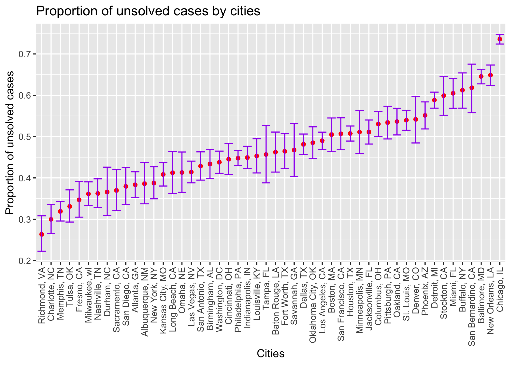

Homework 5
================
Ifrah Fayyaz
11/11/2021

## Loading libraries:

``` r
library(tidyverse)
library(rvest)
library(broom)
```

# Problem 1

``` r
prob1_data = read_csv("homicide-data.csv")
```

**Description:** The homicide dataset contains `12` variables and
`52179` observations. It contains victim characteristics such as
victim’s full name (`victim_first` and `victim_last`), age
(`victim_age`) and sex (`victim_sex`). The homicide data contained is
for the `50` cities and `28` states, with
`Chicago, Philadelphia, Houston` having the most reported homicide
cases.

``` r
# While the solution to this problem was provided to us, I tried doing it on my own 
# and since it works this way, I never changed my code to what was discussed in the 
# office hours:


# Making case_state variable:
prob1 = prob1_data %>%
  mutate(city_state = paste(city, ',', state)) %>%
  mutate(city_state = gsub("+ ,", ",", city_state)) %>%   # Getting rid of whitespace before comma
  select(-city, -state) %>%
  mutate(city_state = as.factor(city_state)) %>%
  mutate(disposition = as.factor(disposition))

# Summarizing within cities to obtain the total number of homicides and the number of unsolved homicides:
cases = prob1 %>% 
  mutate(resolution = if_else(disposition == "Closed by arrest", "solved", "unsolved")) %>%
  filter(city_state != "Tulsa, AL") %>%
  group_by(city_state, resolution) %>%
  summarize(
    n = n()
  ) %>%
  pivot_wider(
    names_from = "resolution",
    values_from = "n"
  ) %>%
  mutate(total = solved + unsolved) %>%
  select(-solved) 

cases %>%
  knitr::kable()
```

| city\_state        | unsolved | total |
|:-------------------|---------:|------:|
| Albuquerque, NM    |      146 |   378 |
| Atlanta, GA        |      373 |   973 |
| Baltimore, MD      |     1825 |  2827 |
| Baton Rouge, LA    |      196 |   424 |
| Birmingham, AL     |      347 |   800 |
| Boston, MA         |      310 |   614 |
| Buffalo, NY        |      319 |   521 |
| Charlotte, NC      |      206 |   687 |
| Chicago, IL        |     4073 |  5535 |
| Cincinnati, OH     |      309 |   694 |
| Columbus, OH       |      575 |  1084 |
| Dallas, TX         |      754 |  1567 |
| Denver, CO         |      169 |   312 |
| Detroit, MI        |     1482 |  2519 |
| Durham, NC         |      101 |   276 |
| Fort Worth, TX     |      255 |   549 |
| Fresno, CA         |      169 |   487 |
| Houston, TX        |     1493 |  2942 |
| Indianapolis, IN   |      594 |  1322 |
| Jacksonville, FL   |      597 |  1168 |
| Kansas City, MO    |      486 |  1190 |
| Las Vegas, NV      |      572 |  1381 |
| Long Beach, CA     |      156 |   378 |
| Los Angeles, CA    |     1106 |  2257 |
| Louisville, KY     |      261 |   576 |
| Memphis, TN        |      483 |  1514 |
| Miami, FL          |      450 |   744 |
| Milwaukee, wI      |      403 |  1115 |
| Minneapolis, MN    |      187 |   366 |
| Nashville, TN      |      278 |   767 |
| New Orleans, LA    |      930 |  1434 |
| New York, NY       |      243 |   627 |
| Oakland, CA        |      508 |   947 |
| Oklahoma City, OK  |      326 |   672 |
| Omaha, NE          |      169 |   409 |
| Philadelphia, PA   |     1360 |  3037 |
| Phoenix, AZ        |      504 |   914 |
| Pittsburgh, PA     |      337 |   631 |
| Richmond, VA       |      113 |   429 |
| Sacramento, CA     |      139 |   376 |
| San Antonio, TX    |      357 |   833 |
| San Bernardino, CA |      170 |   275 |
| San Diego, CA      |      175 |   461 |
| San Francisco, CA  |      336 |   663 |
| Savannah, GA       |      115 |   246 |
| St. Louis, MO      |      905 |  1677 |
| Stockton, CA       |      266 |   444 |
| Tampa, FL          |       95 |   208 |
| Tulsa, OK          |      193 |   583 |
| Washington, DC     |      589 |  1345 |

``` r
# Estimating the proportion of homicides that are unsolved in Baltimore, MD:
baltimore = cases %>%
  filter(city_state == "Baltimore, MD") 

bal = prop.test(
  x = baltimore %>% pull(unsolved),
  n = baltimore %>% pull(total)
)

bal %>% broom::tidy()
```

    ## # A tibble: 1 × 8
    ##   estimate statistic  p.value parameter conf.low conf.high method    alternative
    ##      <dbl>     <dbl>    <dbl>     <int>    <dbl>     <dbl> <chr>     <chr>      
    ## 1    0.646      239. 6.46e-54         1    0.628     0.663 1-sample… two.sided

``` r
# Running prop.test for all the other cities:
all_cities_test = cases %>%
     rowwise %>%
      summarise(out = list(prop.test(unsolved, total) %>%
             tidy)) %>%
      ungroup %>%
  unnest %>%
  select(city_state, estimate, conf.low, conf.high)

all_cities_test %>% knitr::kable()
```

| city\_state        |  estimate |  conf.low | conf.high |
|:-------------------|----------:|----------:|----------:|
| Albuquerque, NM    | 0.3862434 | 0.3372604 | 0.4375766 |
| Atlanta, GA        | 0.3833505 | 0.3528119 | 0.4148219 |
| Baltimore, MD      | 0.6455607 | 0.6275625 | 0.6631599 |
| Baton Rouge, LA    | 0.4622642 | 0.4141987 | 0.5110240 |
| Birmingham, AL     | 0.4337500 | 0.3991889 | 0.4689557 |
| Boston, MA         | 0.5048860 | 0.4646219 | 0.5450881 |
| Buffalo, NY        | 0.6122841 | 0.5687990 | 0.6540879 |
| Charlotte, NC      | 0.2998544 | 0.2660820 | 0.3358999 |
| Chicago, IL        | 0.7358627 | 0.7239959 | 0.7473998 |
| Cincinnati, OH     | 0.4452450 | 0.4079606 | 0.4831439 |
| Columbus, OH       | 0.5304428 | 0.5002167 | 0.5604506 |
| Dallas, TX         | 0.4811742 | 0.4561942 | 0.5062475 |
| Denver, CO         | 0.5416667 | 0.4846098 | 0.5976807 |
| Detroit, MI        | 0.5883287 | 0.5687903 | 0.6075953 |
| Durham, NC         | 0.3659420 | 0.3095874 | 0.4260936 |
| Fort Worth, TX     | 0.4644809 | 0.4222542 | 0.5072119 |
| Fresno, CA         | 0.3470226 | 0.3051013 | 0.3913963 |
| Houston, TX        | 0.5074779 | 0.4892447 | 0.5256914 |
| Indianapolis, IN   | 0.4493192 | 0.4223156 | 0.4766207 |
| Jacksonville, FL   | 0.5111301 | 0.4820460 | 0.5401402 |
| Kansas City, MO    | 0.4084034 | 0.3803996 | 0.4370054 |
| Las Vegas, NV      | 0.4141926 | 0.3881284 | 0.4407395 |
| Long Beach, CA     | 0.4126984 | 0.3629026 | 0.4642973 |
| Los Angeles, CA    | 0.4900310 | 0.4692208 | 0.5108754 |
| Louisville, KY     | 0.4531250 | 0.4120609 | 0.4948235 |
| Memphis, TN        | 0.3190225 | 0.2957047 | 0.3432691 |
| Miami, FL          | 0.6048387 | 0.5685783 | 0.6400015 |
| Milwaukee, wI      | 0.3614350 | 0.3333172 | 0.3905194 |
| Minneapolis, MN    | 0.5109290 | 0.4585150 | 0.5631099 |
| Nashville, TN      | 0.3624511 | 0.3285592 | 0.3977401 |
| New Orleans, LA    | 0.6485356 | 0.6231048 | 0.6731615 |
| New York, NY       | 0.3875598 | 0.3494421 | 0.4270755 |
| Oakland, CA        | 0.5364308 | 0.5040588 | 0.5685037 |
| Oklahoma City, OK  | 0.4851190 | 0.4467861 | 0.5236245 |
| Omaha, NE          | 0.4132029 | 0.3653146 | 0.4627477 |
| Philadelphia, PA   | 0.4478103 | 0.4300380 | 0.4657157 |
| Phoenix, AZ        | 0.5514223 | 0.5184825 | 0.5839244 |
| Pittsburgh, PA     | 0.5340729 | 0.4942706 | 0.5734545 |
| Richmond, VA       | 0.2634033 | 0.2228571 | 0.3082658 |
| Sacramento, CA     | 0.3696809 | 0.3211559 | 0.4209131 |
| San Antonio, TX    | 0.4285714 | 0.3947772 | 0.4630331 |
| San Bernardino, CA | 0.6181818 | 0.5576628 | 0.6753422 |
| San Diego, CA      | 0.3796095 | 0.3354259 | 0.4258315 |
| San Francisco, CA  | 0.5067873 | 0.4680516 | 0.5454433 |
| Savannah, GA       | 0.4674797 | 0.4041252 | 0.5318665 |
| St. Louis, MO      | 0.5396541 | 0.5154369 | 0.5636879 |
| Stockton, CA       | 0.5990991 | 0.5517145 | 0.6447418 |
| Tampa, FL          | 0.4567308 | 0.3881009 | 0.5269851 |
| Tulsa, OK          | 0.3310463 | 0.2932349 | 0.3711192 |
| Washington, DC     | 0.4379182 | 0.4112495 | 0.4649455 |

``` r
# Making ggplot for all cities:
all_cities_test %>%
  ggplot(aes(x = reorder(city_state, estimate), y = estimate)) +
  geom_point(color = "red") +
  theme(axis.text.x = element_text(angle = 90, vjust = 0.5, hjust = 1)) +
  geom_errorbar(aes(ymin = conf.low, ymax = conf.high), color = "purple") +
  labs(
    x = "Cities",
    y = "Proportion of unsolved cases",
    title = "Proportion of unsolved cases by cities"
  )
```

<!-- -->

# Problem 2

``` r
prob2 = tibble(
  filename = list.files("./data/")
  )

con_exp = function(path) {
  df = tibble(
    obs = path %>%
       map(read_csv))
}

prob2 = prob2 %>%
  mutate(filepath = paste0("./data/", filename)) 

prob2 = prob2 %>%
  mutate(con_exp(prob2$filepath)) %>%
  select(-filepath)


prob2_tidy = 
  prob2 %>%
  unnest() 

prob2_tidy = prob2_tidy %>%
  pivot_longer(
    week_1:week_8,
    names_to = "week",
    values_to = "obs"
  ) %>%
  rename(subject_id = filename) %>%
  mutate(subject_id = sub("\\..*", "", subject_id)) %>%
  mutate(arm = sub("\\_.*", "", subject_id)) %>%
  mutate(week = sub('.*\\_', '', week)) 

ggplot(data = prob2_tidy, aes(x = week, y = obs, group = subject_id, color = arm)) + 
  geom_line() +
  labs(
    title = "Observations over time",
    x = "Weeks",
    y = "Observations"
  ) + 
  scale_colour_discrete(name = "Study Arm: ", labels = c("Control", "Experimental")) + 
    theme(legend.position = "bottom")
```

<!-- -->

**Description:** The spaghetti plot above shows the observations of 20
subjects over time - 10 registered in the control arm and 10 in the
experimental arm. We can see visible differences between groups where
participants in the control arm show lower observations than the
participants in the experimental arm that show an increasing trend in
their observations. The observations of the participants in the control
arm do not show any increasing or decreasing trends over time.

# Problem 3

``` r
set.seed(10)

iris_with_missing = iris %>% 
  map_df(~replace(.x, sample(1:150, 20), NA)) %>%
  mutate(Species = as.character(Species))
```
